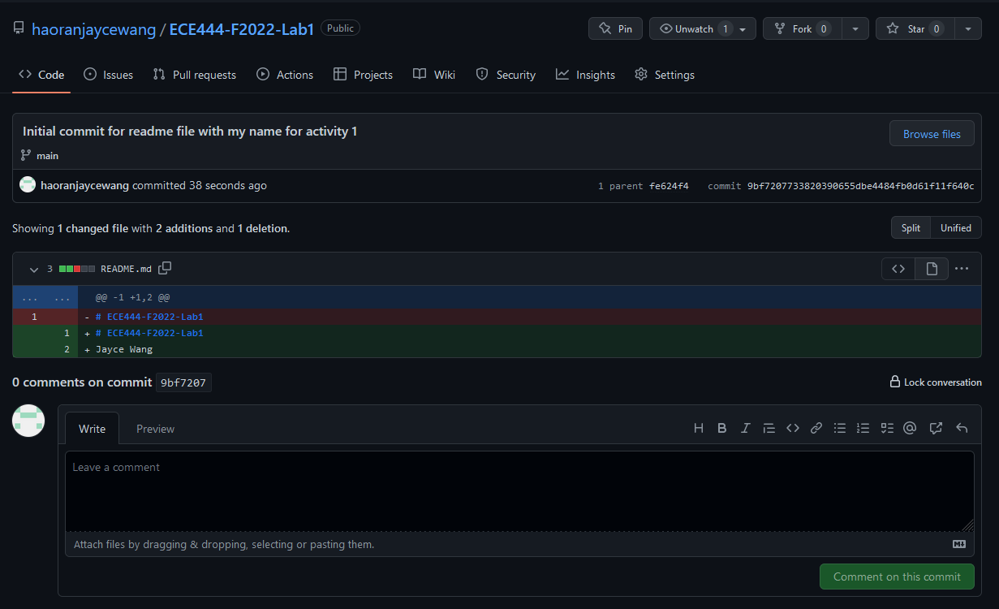
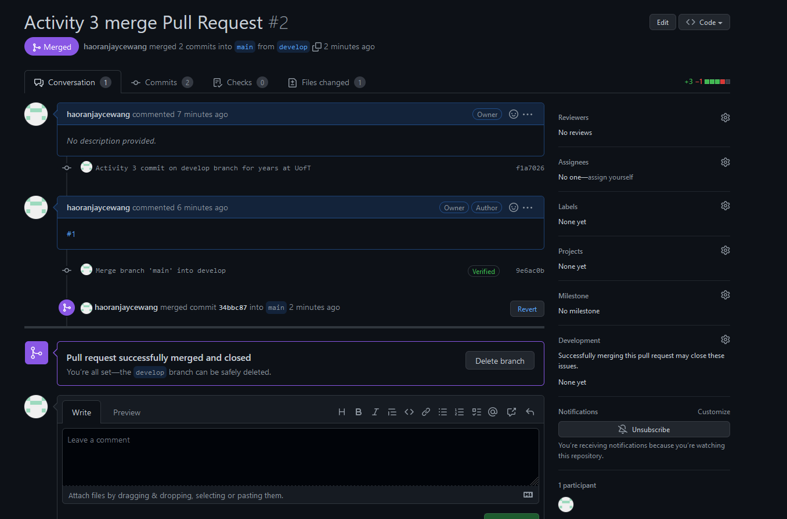
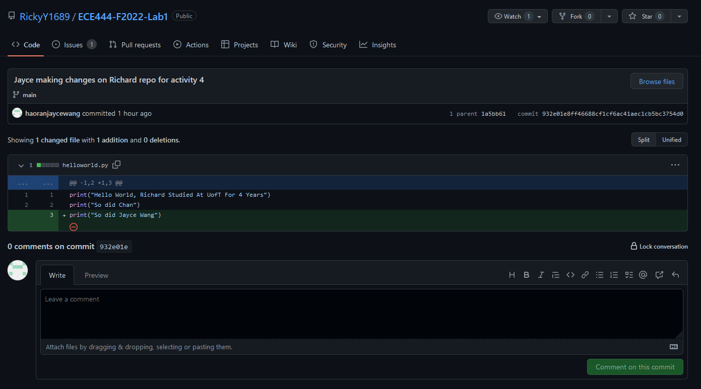
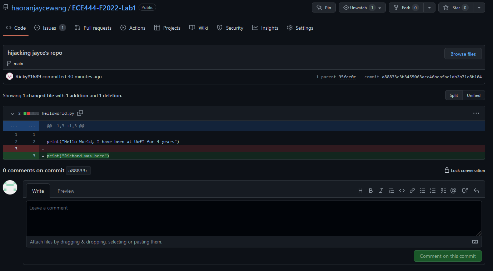
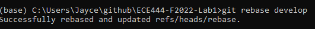
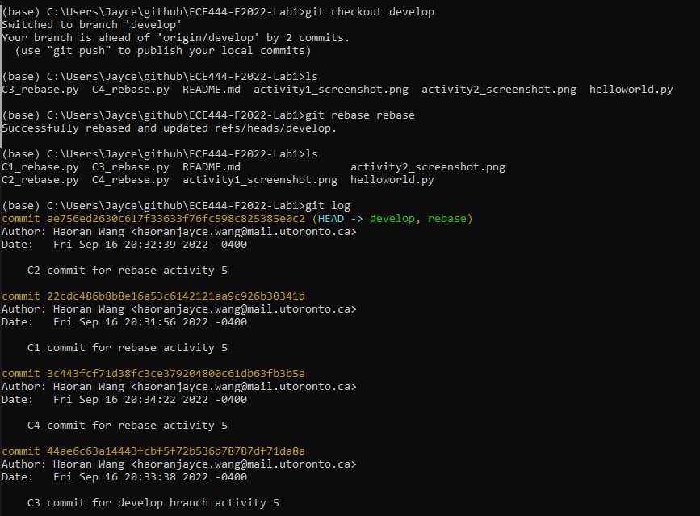

# ECE444-F2022-Lab1
Jayce Wang

**Activity 1 screenshot of readme commit:**

**Activity 2 screenshot of merge:**

**Activity 3 screenshot of merge:**

**Activity 4:**

Teammate's Repo: https://github.com/RickyY1689/ECE444-F2022-Lab1

**Activity 5**

First I checkedout the rebase branch and ran this:
 so that the commits in rebase branch were ordered after commits in develop branch

Then I checkedout the develop branch and called rebase to move C1, C2 after C4 on develop branch:

  as shown C1 and C2 commits now go after C4

**LINK TO EP REPO**

https://github.com/haoranjaycewang/ECE444-F2022-EP